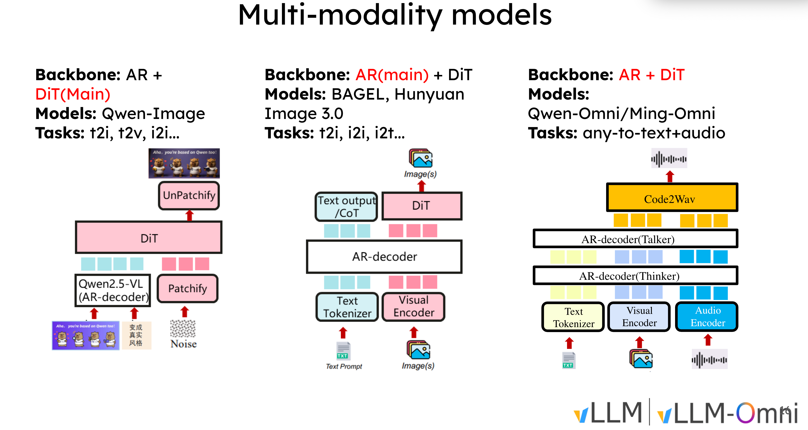

# Omni-Modality Serving

> Parent: [Applications](00_Applications.md)

## Overview

Omni-modality models accept **any combination** of inputs (text, image, audio, video) and produce **heterogeneous outputs** (text, audio waveforms, images, latent vectors). Serving these models is fundamentally harder than serving text-only LLMs because:

1. **Multi-stage pipelines** — a single request may traverse 2-3 separate models (e.g., understand → synthesize → decode)
2. **Mixed architectures** — autoregressive (AR) stages coexist with non-autoregressive (non-AR) stages like diffusion transformers
3. **Heterogeneous data flow** — intermediate representations (embeddings, RVQ codes, latents) must transfer between stages efficiently
4. **Resource heterogeneity** — different stages have vastly different compute/memory profiles

This page uses **vLLM-Omni** as a concrete case study to examine how these problems are solved in practice.

## Case Study: vLLM-Omni

[vLLM-Omni](https://github.com/vllm-project/vllm-omni) extends vLLM from text-only autoregressive serving to full omni-modality inference. Its key insight is a **fully disaggregated pipeline architecture** where each stage runs as an independent process with its own engine, GPU allocation, and scheduler.

### Multi-Modality Model Architectures

vLLM-Omni supports three distinct architectural patterns for multi-modality models, each combining AR and DiT components differently:



**Pattern 1: AR + DiT(Main)** — Models like **Qwen-Image** where the AR decoder (Qwen2.5-VL) processes text/image inputs and produces tokens that are patchified into latent space, then a DiT performs the main generation work (denoising), and UnPatchify reconstructs the output image. The DiT is the primary generation backbone. Tasks: text-to-image (t2i), text-to-video (t2v), image-to-image (i2i).

**Pattern 2: AR(Main) + DiT** — Models like **BAGEL** and **Hunyuan Image 3.0** where the AR decoder is the main backbone. It takes text (via tokenizer) and images (via visual encoder) as input, autoregressively generates both text output / chain-of-thought tokens and image latent tokens in a unified sequence. The DiT operates as an auxiliary module that refines the image latents into the final output. Tasks: text-to-image (t2i), image-to-image (i2i), image-to-text (i2t).

**Pattern 3: AR + DiT (Omni)** — Models like **Qwen-Omni** and **Ming-Omni** that accept any modality (text, image, audio) through dedicated encoders (text tokenizer, visual encoder, audio encoder). The AR pipeline has two stages: a **Thinker** that processes all inputs and generates text/reasoning tokens, and a **Talker** that converts those into audio codec codes (RVQ). A **Code2Wav** DiT stage then synthesizes the final audio waveform. Tasks: any-to-text+audio.

The key architectural difference is *where the generation bottleneck sits*: in Pattern 1 it is the DiT, in Pattern 2 it is the AR decoder, and in Pattern 3 both AR and DiT stages are critical, requiring the disaggregated multi-stage pipeline that vLLM-Omni provides.

### Supported Models

| Model | Stages | Input | Output | Architecture |
|-------|--------|-------|--------|-------------|
| Qwen3-Omni-MoE | 3 (Thinker → Talker → Code2Wav) | Text + Audio + Image + Video | Text + Audio | MoE + RVQ + DiT |
| Qwen2.5-Omni | 3 (Thinker → Talker → Token2Wav) | Text + Audio + Image + Video | Text + Audio | Dense + RVQ + DiT |
| MammothModa2 | 2 (AR → DiT) | Text + Image | Text + Image | AR + DiT |
| Bagel | 2 (AR → DiT) | Text + Image | Video | AR + DiT |
| GLM-Image | 1 (AR) | Text | Image | AR token prediction |
| MiMo-Audio | 2 (LLM → Code2Wav) | Text + Audio | Text + Audio | LLM + vocoder |
| Qwen3-TTS | 2 (Talker → Code2Wav) | Text | Audio | AR + DiT |

### Project Structure

```
vllm_omni/
├── entrypoints/          # User-facing API (Omni, AsyncOmni, OmniStage)
│   ├── omni.py           # Synchronous multi-stage orchestrator
│   ├── async_omni.py     # Async version for high-concurrency serving
│   ├── omni_stage.py     # Per-stage lifecycle manager
│   └── openai/           # OpenAI-compatible REST API
├── engine/               # Input/output processing
│   ├── arg_utils.py      # OmniEngineArgs (extends vLLM EngineArgs)
│   ├── input_processor.py    # Multimodal input preprocessing
│   └── output_processor.py   # Modality-routed output handling
├── model_executor/       # Model implementations
│   ├── models/           # Per-model directories (qwen3_omni/, bagel/, etc.)
│   ├── stage_configs/    # YAML pipeline definitions
│   └── stage_input_processors/  # Inter-stage data transforms
├── core/sched/           # Schedulers
│   ├── omni_ar_scheduler.py         # For autoregressive stages
│   └── omni_generation_scheduler.py # For non-AR stages (diffusion)
├── distributed/          # Distributed execution
│   └── omni_connectors/  # Inter-stage IPC (SharedMemory, Mooncake, etc.)
├── inputs/               # Omni-specific input data types
├── outputs/              # Omni-specific output types
├── diffusion/            # DiT support (schedulers, VAE, pipelines)
└── platforms/            # Hardware abstraction (CUDA, ROCm, NPU, XPU)
```

## Problem 1: Multi-Stage Pipeline Orchestration

### The Challenge

An omni model like Qwen3-Omni is not one model — it is three:

```
User: "Describe this image" + [photo]
         │
         ▼
┌─────────────────┐   hidden states   ┌─────────────────┐   RVQ codes   ┌─────────────────┐
│  Stage 0:       │ ───────────────►  │  Stage 1:       │ ───────────► │  Stage 2:       │
│  Thinker (AR)   │                   │  Talker (AR)    │              │  Code2Wav (DiT) │
│  GPU 0          │                   │  GPU 1          │              │  GPU 1          │
│                 │                   │                 │              │                 │
│ Input: text +   │   Output: text +  │ Input: embeds   │  Output:     │ Input: codes    │
│ image/audio/    │   latent embeds   │ from thinker    │  8-layer     │ Output: audio   │
│ video           │                   │                 │  RVQ codes   │ waveform (24kHz)│
└─────────────────┘                   └─────────────────┘              └─────────────────┘
```

Each stage has different compute characteristics, different batch sizes, different sampling parameters, and may even run different architecture types (AR vs. diffusion).

### How vLLM-Omni Solves It: Declarative Stage Configs

Each pipeline is defined as a YAML configuration that fully specifies every stage:

```yaml
# stage_configs/qwen3_omni_moe.yaml — verified on 2x H100-80G
async_chunk: false
stage_args:
  - stage_id: 0
    stage_type: llm
    runtime:
      devices: "0"                    # Pin to GPU 0
      max_batch_size: 64
    engine_args:
      model_stage: thinker
      model_arch: Qwen3OmniMoeForConditionalGeneration
      worker_type: ar                 # Autoregressive worker
      scheduler_cls: ...OmniARScheduler
      gpu_memory_utilization: 0.9
      engine_output_type: latent      # Output hidden states, not text
    final_output: true
    final_output_type: text           # Also emit text to the user
    default_sampling_params:
      temperature: 0.4
      max_tokens: 2048

  - stage_id: 1
    stage_type: llm
    runtime:
      devices: "1"                    # Pin to GPU 1
    engine_args:
      model_stage: talker
      worker_type: ar
      engine_output_type: latent      # Output codec codes
    engine_input_source: [0]          # Receives from stage 0
    custom_process_input_func: ...qwen3_omni.thinker2talker
    default_sampling_params:
      temperature: 0.9
      stop_token_ids: [2150]          # TALKER_CODEC_EOS

  - stage_id: 2
    stage_type: llm
    runtime:
      devices: "1"                    # Shares GPU 1 with talker
    engine_args:
      model_stage: code2wav
      worker_type: generation         # Non-autoregressive!
      scheduler_cls: ...OmniGenerationScheduler
      engine_output_type: audio       # Final output: waveform
    engine_input_source: [1]          # Receives from stage 1
    custom_process_input_func: ...qwen3_omni.talker2code2wav
    final_output_type: audio
```

Key design decisions:
- **`engine_input_source`** declares stage dependencies — stage 1 reads from stage 0's outputs
- **`custom_process_input_func`** points to a Python function that transforms one stage's output into the next stage's input
- **`worker_type`** selects between `ar` (autoregressive) and `generation` (non-AR/diffusion) execution
- **`final_output` / `final_output_type`** controls which stages emit results to the user (a model can emit both text from stage 0 and audio from stage 2)

### The Orchestrator: `Omni` Class

The `Omni` class (`entrypoints/omni.py`) manages the full lifecycle:

```python
# Simplified usage from examples/offline_inference/qwen3_omni/end2end.py
from vllm_omni.entrypoints.omni import Omni

omni = Omni(
    model="Qwen/Qwen3-Omni-30B-A3B-Instruct",
    stage_configs_path="path/to/config.yaml",
)

# Each stage gets its own sampling params
sampling_params_list = [
    SamplingParams(temperature=0.4, max_tokens=2048),   # Thinker
    SamplingParams(temperature=0.9, stop_token_ids=[2150]),  # Talker
    SamplingParams(temperature=0.0, max_tokens=65536),   # Code2Wav
]

for output in omni.generate(prompts, sampling_params_list):
    if output.final_output_type == "text":
        print(output.request_output.outputs[0].text)
    elif output.final_output_type == "audio":
        audio = output.request_output.outputs[0].multimodal_output["audio"]
        sf.write("out.wav", audio.numpy(), samplerate=24000)
```

Internally, `Omni` spawns each stage as a separate process, wires up IPC connectors, and manages the data flow. Each `OmniStage` wraps a vLLM `AsyncLLM` engine or a custom diffusion executor.

## Problem 2: Inter-Stage Data Transfer

### The Challenge

Between stages, the data is not text — it is dense tensors (embeddings, hidden states, codec codes). These can be large (megabytes per request) and must transfer between processes that may run on different GPUs.

### How vLLM-Omni Solves It: Stage Input Processors + Connectors

**Stage Input Processors** are functions that transform one stage's raw output into the next stage's input format. For the Thinker → Talker transition:

```python
# stage_input_processors/qwen3_omni.py
def thinker2talker(stage_list, engine_input_source, ...):
    """
    1. Extract thinker's hidden states and token IDs
    2. Compute talker prompt length from thinker's conversation structure
    3. Package embeddings + metadata into OmniTokensPrompt
    """
    thinker_outputs = stage_list[engine_input_source[0]].engine_outputs

    for thinker_output in thinker_outputs:
        output = thinker_output.outputs[0]
        info = {
            # Hidden states at layer boundaries
            "thinker_prefill_embeddings": output.multimodal_output["0"],
            "thinker_hidden_states": output.multimodal_output["24"],
            # Full token sequence for positional alignment
            "thinker_sequences": thinker_output.prompt_token_ids + output.token_ids,
            "thinker_input_ids": thinker_output.prompt_token_ids,
            # TTS special token embeddings for talker projection
            "tts_bos_embed": output.multimodal_output["tts_bos_embed"],
            "tts_eos_embed": output.multimodal_output["tts_eos_embed"],
            "tts_pad_embed": output.multimodal_output["tts_pad_embed"],
        }
        prompt_len = _compute_talker_prompt_ids_length(info)
        talker_inputs.append(OmniTokensPrompt(
            prompt_token_ids=[0] * prompt_len,  # Placeholder tokens
            additional_information=info,         # Actual data via embeddings
        ))
```

For the Talker → Code2Wav transition, the processor extracts 8-layer RVQ codec codes and flattens them:

```python
def talker2code2wav(stage_list, engine_input_source, ...):
    for talker_output in talker_outputs:
        output = talker_output.outputs[0]
        # Shape: [8, seq_len] → flattened to 1D token list
        codec_codes = (
            output.multimodal_output["code_predictor_codes"][-seq_len:]
            .to(torch.long).transpose(0, 1).reshape(-1).tolist()
        )
        code2wav_inputs.append(OmniTokensPrompt(
            prompt_token_ids=codec_codes,
        ))
```

**OmniConnectors** handle the physical data transfer between processes:

```
┌─────────────────────────────────────────────────────┐
│                  OmniConnectorBase                  │
│         put(request_id, data) / get(request_id)     │
├────────────┬────────────────┬───────────────────────┤
│ SharedMemory│ MooncakeStore │ MooncakeTransferEngine│
│ Connector   │ Connector     │ Connector (RDMA)      │
│ (local IPC) │ (distributed) │ (high-perf network)   │
├────────────┴────────────────┴───────────────────────┤
│                 YuanrongConnector                   │
└─────────────────────────────────────────────────────┘
```

- **SharedMemoryConnector** — fast local IPC for single-node deployments (configurable size threshold)
- **MooncakeStoreConnector / MooncakeTransferEngineConnector** — distributed KV store and RDMA-based transfer for multi-node
- **YuanrongConnector** — alternative distributed connector

The connector is selected via configuration and is transparent to the stage logic.

## Problem 3: Mixed AR and Non-AR Architectures

### The Challenge

Within a single pipeline, some stages are autoregressive (token-by-token generation) and others are non-autoregressive (diffusion — iterative denoising over fixed-size tensors). These have fundamentally different scheduling needs:

- **AR stages**: KV cache management, variable-length sequences, speculative decoding
- **Non-AR stages**: Fixed compute per step, batch-level scheduling, no KV cache

### How vLLM-Omni Solves It: Dual Scheduler Architecture

vLLM-Omni provides two scheduler implementations, selectable per stage via `scheduler_cls`:

```
                    ┌───────────────────┐
                    │  OmniARScheduler  │  For Thinker, Talker stages
                    │                   │  - Leverages vLLM's KV cache mgmt
                    │                   │  - Variable-length sequence support
                    │                   │  - Prefix caching (optional)
                    └───────────────────┘

          ┌─────────────────────────────────┐
          │  OmniGenerationScheduler        │  For Code2Wav, DiT stages
          │                                 │  - No KV cache required
          │                                 │  - Fixed-step iterative execution
          │                                 │  - Batch-oriented scheduling
          │                                 │  - max_num_batched_tokens: 1000000
          └─────────────────────────────────┘
```

The stage config declares which scheduler each stage uses:

```yaml
# AR stage (Thinker)
scheduler_cls: vllm_omni.core.sched.omni_ar_scheduler.OmniARScheduler

# Non-AR stage (Code2Wav / DiT)
scheduler_cls: vllm_omni.core.sched.omni_generation_scheduler.OmniGenerationScheduler
```

The `worker_type` field (`ar` vs `generation`) selects the corresponding execution backend, so vLLM's efficient KV cache management is used where applicable, and a custom generation executor is used for diffusion stages.

## Problem 4: Heterogeneous Output Handling

### The Challenge

Different stages produce fundamentally different data types: text tokens, embedding tensors, audio waveforms, or images. The output pipeline must route each type correctly and handle incremental accumulation (e.g., streaming audio chunks).

### How vLLM-Omni Solves It: `MultimodalOutputProcessor`

The output processor (`engine/output_processor.py`) extends vLLM's text-focused `OutputProcessor`:

```python
class MultimodalOutputProcessor(VLLMOutputProcessor):
    """
    Data flow:
    1. For each EngineCoreOutput with pooling_output:
       - Capture into OmniRequestState.add_multimodal_tensor()
       - Clear pooling_output to force text path in base processor
    2. Base vLLM OutputProcessor handles text detokenization
    3. On finish, consolidate accumulated tensor chunks
    4. Attach multimodal dict to CompletionOutput
    """

    def process_outputs(self, engine_core_outputs, ...):
        for eco in engine_core_outputs:
            req_state = self.request_states.get(eco.request_id)
            if eco.pooling_output is not None and req_state.detokenizer is not None:
                # Route multimodal data to tensor accumulator
                req_state.add_multimodal_tensor(eco.pooling_output, mm_type)
                eco.pooling_output = None  # Force text path for base processor
        return super().process_outputs(engine_core_outputs, ...)
```

`OmniRequestState` tracks per-request multimodal tensors and handles incremental accumulation efficiently (list-based to avoid O(n^2) repeated concatenation):

```python
class OmniRequestState(RequestState):
    mm_type: str | None       # "audio", "image", "latent", etc.
    mm_accumulated: dict      # {modality_key: tensor_or_list}

    def add_multimodal_tensor(self, payload, mm_type):
        # Normalize keys: "hidden" and "model_outputs" → semantic modality key
        # Accumulate tensors as lists, defer concatenation
        ...

    def _consolidate_multimodal_tensors(self):
        # Called on finish: torch.cat all accumulated tensor lists
        # Special handling: audio dim=-1, sample rate keeps last value
        ...
```

The `engine_output_type` field in the stage config tags what each stage produces:

```yaml
engine_output_type: latent   # Stage 0: hidden states for next stage
engine_output_type: latent   # Stage 1: codec codes for next stage
engine_output_type: audio    # Stage 2: final audio waveform
```

## Problem 5: Multimodal Input Preprocessing

### The Challenge

A single prompt can contain text, images, audio, and video simultaneously. Each modality needs different preprocessing (tokenization, resampling, frame extraction), and the results must be unified into a single embedding space for the model.

### How vLLM-Omni Solves It: Extended Input Types + Special Tokens

vLLM-Omni extends vLLM's input types with Omni-specific variants that carry inter-stage metadata:

```python
# inputs/data.py
class OmniTextPrompt(TextPrompt):
    prompt_embeds: NotRequired[torch.Tensor]        # Pre-computed embeddings
    additional_information: NotRequired[dict]        # Inter-stage payload

class OmniTokensPrompt(TokensPrompt):
    prompt_embeds: NotRequired[torch.Tensor]
    additional_information: NotRequired[dict]        # Carries thinker→talker data

class OmniEmbedsPrompt(EmbedsPrompt):
    additional_information: NotRequired[dict]
```

The `additional_information` dict is the key mechanism for passing arbitrary tensors and metadata between stages without modifying vLLM's core input pipeline.

At the user-facing level, multimodal inputs are passed via special tokens in the prompt:

```python
# Audio input — special tokens mark where audio features are injected
prompt = (
    "<|im_start|>user\n"
    "<|audio_start|><|audio_pad|><|audio_end|>"  # Audio placeholder
    "What is the content of this audio?<|im_end|>\n"
    "<|im_start|>assistant\n"
)
inputs = {
    "prompt": prompt,
    "multi_modal_data": {
        "audio": (audio_signal, sample_rate),  # numpy array + sr
    },
}

# Image + Video + Audio simultaneously
prompt = (
    "<|audio_start|><|audio_pad|><|audio_end|>"
    "<|vision_start|><|image_pad|><|vision_end|>"
    "<|vision_start|><|video_pad|><|vision_end|>"
    "Describe everything.<|im_end|>\n"
)
inputs = {
    "prompt": prompt,
    "multi_modal_data": {
        "audio": (signal, sr),
        "image": pil_image,
        "video": np_frames,      # [num_frames, H, W, C]
    },
}
```

The model's multimodal processor (in the Thinker stage) replaces each `<|*_pad|>` token with the actual encoded features from the corresponding encoder (Whisper-like for audio, ViT for image/video).

## Problem 6: Conditional Model Loading

### The Challenge

A single HuggingFace checkpoint (e.g., `Qwen3-Omni-30B`) contains weights for all stages (thinker, talker, code2wav), but each process should only load the weights it needs.

### How vLLM-Omni Solves It: `model_stage` + Registry Pattern

Each stage config declares a `model_stage` (e.g., `thinker`, `talker`, `code2wav`) and a `model_arch`. The model class uses `model_stage` to conditionally initialize only the relevant sub-model:

```python
# Conceptual pattern from model implementations
class Qwen3OmniMoeForConditionalGeneration:
    def __init__(self, config, model_stage, ...):
        if model_stage == "thinker":
            self.thinker = init_vllm_registered_model(...)  # Multimodal encoder + LLM
        elif model_stage == "talker":
            self.talker = init_vllm_registered_model(...)   # Embedding → RVQ predictor
        elif model_stage == "code2wav":
            self.token2wav = init_vllm_registered_model(...) # DiT vocoder
```

The `OmniModelRegistry` extends vLLM's model registry with lazy loading:

```python
# model_executor/models/registry.py
_OMNI_MODELS = {
    "Qwen3OmniMoeForConditionalGeneration": (
        "qwen3_omni", "qwen3_omni", "Qwen3OmniMoeForConditionalGeneration"
    ),
    "MammothModa2ForConditionalGeneration": (
        "mammoth_moda2", "mammoth_moda2", "MammothModa2ForConditionalGeneration"
    ),
    # ... 20+ model architectures
}

OmniModelRegistry = _ModelRegistry({
    # Merge vLLM's models with Omni-specific models
    **{arch: _LazyRegisteredModel(f"vllm.model_executor.models.{mod}", cls)
       for arch, (mod, cls) in _VLLM_MODELS.items()},
    **{arch: _LazyRegisteredModel(f"vllm_omni.model_executor.models.{folder}.{mod}", cls)
       for arch, (folder, mod, cls) in _OMNI_MODELS.items()},
})
```

Additionally, `hf_config_name` in the stage config selects which sub-config from the HuggingFace checkpoint to use (e.g., `thinker_config` vs `talker_config`), so each stage loads the correct hyperparameters.

## Problem 7: Diffusion Model Integration

### The Challenge

vLLM was built around autoregressive token generation with KV caches. Diffusion models (DiT) work completely differently — iterative denoising over fixed-size latent tensors, with no KV cache, no variable-length sequences, and no token-by-token generation.

### How vLLM-Omni Solves It: Diffusion Stack

vLLM-Omni includes a dedicated `diffusion/` module that provides:

```
vllm_omni/diffusion/
├── schedulers/      # Noise schedules (DDPM, Flow Matching, etc.)
├── vae/             # Variational autoencoders for latent ↔ pixel/audio
└── pipelines/       # Full diffusion pipelines (text-to-image, etc.)
```

The `OmniGenerationScheduler` manages diffusion requests at the batch level. The `OmniDiffusionSamplingParams` dataclass carries all diffusion-specific parameters:

```python
@dataclass
class OmniDiffusionSamplingParams:
    # Spatial dimensions
    height: int | None = None
    width: int | None = None
    num_frames: int = 1

    # Diffusion parameters
    num_inference_steps: int = 50
    guidance_scale: float = 0.0
    timesteps: torch.Tensor | None = None

    # Inter-stage KV transfer (for models like Bagel)
    past_key_values: Any | None = None
    kv_metadata: dict[str, Any] | None = None

    # Component modules (injected at runtime)
    modules: dict[str, Any] = field(default_factory=dict)

    # CFG (Classifier-Free Guidance) with multi-KV support
    cfg_text_past_key_values: Any | None = None
    cfg_img_past_key_values: Any | None = None
```

This allows the same `Omni` orchestrator to manage both AR text generation and DiT image/audio generation within a single pipeline.

## Architecture Summary

```
                         ┌──────────────────────┐
                         │     User Request      │
                         │  text + image + audio  │
                         └──────────┬───────────┘
                                    │
                         ┌──────────▼───────────┐
                         │    Omni Orchestrator   │
                         │  (omni.py / async)     │
                         │  Reads stage YAML      │
                         │  Spawns N processes    │
                         └──────────┬───────────┘
                                    │
              ┌─────────────────────┼─────────────────────┐
              │                     │                     │
    ┌─────────▼─────────┐ ┌────────▼────────┐ ┌─────────▼─────────┐
    │ Stage 0: Thinker  │ │ Stage 1: Talker │ │ Stage 2: Code2Wav │
    │ OmniARScheduler   │ │ OmniARScheduler │ │ OmniGenScheduler  │
    │ worker_type: ar   │ │ worker_type: ar │ │ worker_type: gen  │
    │ GPU 0, 90% mem    │ │ GPU 1, 60% mem  │ │ GPU 1, 10% mem    │
    │                   │ │                 │ │                   │
    │ Vision Encoder    │ │ Embedding proj  │ │ DiT denoiser      │
    │ Audio Encoder     │ │ RVQ predictor   │ │ VAE decoder       │
    │ Language Model    │ │                 │ │                   │
    └────────┬──────────┘ └───────┬─────────┘ └────────┬──────────┘
             │                    │                     │
             │ thinker2talker()   │ talker2code2wav()   │
             │ (hidden states)    │ (RVQ codes)         │
             ▼                    ▼                     ▼
    ┌────────────────────────────────────────────────────────────┐
    │              OmniConnectors (IPC Layer)                    │
    │  SharedMemory │ Mooncake (KV store) │ RDMA │ Yuanrong     │
    └────────────────────────────────────────────────────────────┘
             │                    │                     │
             ▼                    ▼                     ▼
    ┌────────────────────────────────────────────────────────────┐
    │           MultimodalOutputProcessor                        │
    │  Accumulates tensors per request, consolidates on finish   │
    │  Routes: text → detokenizer, audio/image → tensor concat   │
    └───────────────────────────┬────────────────────────────────┘
                                │
                    ┌───────────▼───────────┐
                    │   OmniRequestOutput    │
                    │  .final_output_type    │
                    │  "text" → .text        │
                    │  "audio" → .multimodal │
                    │  "image" → .multimodal │
                    └────────────────────────┘
```

## Key Takeaways

1. **Disaggregation over monolithic** — running each stage as an independent process with its own engine enables independent scaling, GPU assignment, and failure isolation
2. **Declarative pipeline definition** — YAML stage configs make it easy to reconfigure pipelines without code changes (swap GPUs, adjust batch sizes, change sampling)
3. **Architecture-agnostic scheduling** — dual schedulers (AR + Generation) let the same orchestrator manage both autoregressive and diffusion stages transparently
4. **Typed inter-stage data flow** — `custom_process_input_func` + `additional_information` dict provide a clean contract between stages while keeping the core vLLM input pipeline unchanged
5. **Connector abstraction** — pluggable IPC backends (shared memory for single-node, RDMA for multi-node) make the same pipeline definition work across deployment scales
6. **Incremental output accumulation** — list-based tensor accumulation avoids O(n^2) concatenation for streaming outputs, consolidating only on completion

## Related

- [Vision-Language Models](../vision_language/00_Vision_Language.md) — the understanding backbone used in Thinker stages
- [Diffusion Models](../diffusion/00_Diffusion.md) — the generation backbone used in DiT stages
- [AI_Infra: Multimodal Inference](../../AI_Infra/inference/07_Multimodal_Inference.md) — broader infrastructure for serving these models
